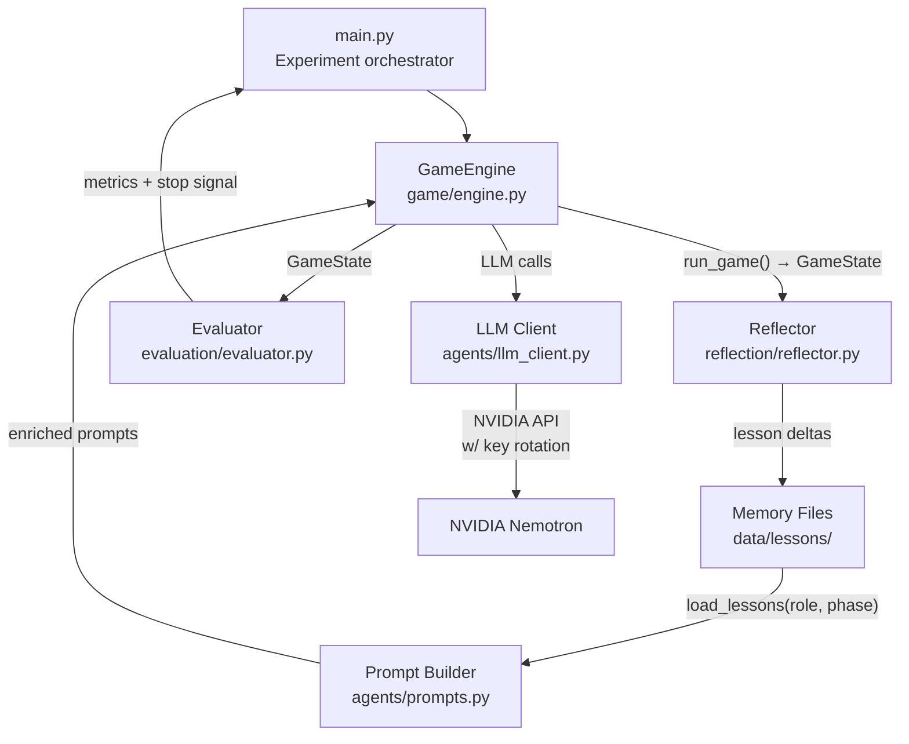

# Avalon Self-Learning Agents

> Five LLM agents play *The Resistance: Avalon* repeatedly against each other.
> After every game, each agent reflects on its own performance and extracts structured strategic lessons.
> Those lessons are stored in memory and injected back into future games — making agents sharper over time, with no gradient updates or human supervision.

---

## What is this?

This project is a **closed-loop self-learning experiment** for the social deduction game [*The Resistance: Avalon*](https://boardgamegeek.com/boardgame/128882/). Five LLM agents — each assigned one of the game's five roles — play full games against each other. After each game, a structured reflection pipeline extracts strategic lessons from the game transcript. Those lessons accumulate in per-role memory files and are fed back into the prompts of subsequent games.

The core insight: rather than adjusting model weights, agents improve by building a **structured textual memory** of what works and what doesn't, validated and consolidated by the same LLM that plays the game.

This is a personal research/portfolio project exploring how far pure in-context, memory-driven learning can take LLM agents in a competitive, adversarial setting.

---

## Key Features

- 🎮 **Full game simulation** — complete Avalon rules: discussion, proposal, voting, missions, and the Assassin's final guess
- 🧠 **Reflective self-play** — after every game, 7 structured LLM calls extract lessons from the transcript (5 per-role + 2 team coordination)
- 📚 **Structured lesson memory** — per-role, phase-bucketed lesson files with a `tentative → active → deprecated` lifecycle
- ✅ **Machine-validated lessons** — every lesson is validated against structural rules before storage; malformed lessons are repaired or dropped automatically
- 🔄 **Lesson consolidation** — periodic LLM-driven passes promote high-confidence lessons, merge duplicates, and deprecate contradicted ones
- 🤝 **Coordination memory** — shared strategy files for the good team and the evil team, updated alongside individual role memory
- 🔑 **Multi-key API rotation** — up to 3 NVIDIA API keys with automatic failover on rate limits or server errors
- 💾 **Resume support** — experiments survive interruptions and resume exactly where they left off
- 📊 **Convergence detection** — auto-stops when win rates or lesson files stabilize (configurable thresholds)
- 📋 **Detailed logging** — per-game transcripts, JSON parse failure logs, lesson validation debug logs, and periodic checkpoints

---

## How Agents Learn

Each game produces a `GameState` containing the full game transcript: all statements, votes, proposals, mission outcomes, and each agent's private in-game notes. After the game ends:

```
For each role (5) + each coordination file (2):
  1. Build context   ← agent's own actions + full game log
  2. Call reflection LLM → structured JSON delta
     {
       "add_tentative":   [{ "phase": "vote", "lesson": "When ..., do ... because ... (observed on WIN)" }],
       "confirm_active":  [{ "phase": "discussion", "keyword": "..." }],
       "flag_deprecated": [{ "phase": "proposal", "keyword": "...", "reason": "..." }]
     }
  3. Validate each lesson (structure, length, action verb, no vague filler)
  4. Repair if needed (truncate length, append outcome tag)
  5. Drop if still invalid → log to reflection_debug.log
  6. Sanitize player names → "a player" (prevent overfitting to specific games)
  7. Apply delta to lesson file
```

Lessons follow a strict format:
```
When <trigger>, <action> because <reason>. (observed on WIN|LOSS)
```

They are bucketed by game phase and stored with `TENTATIVE` status. During **consolidation** (scheduled at games 5, 10, then every 20), an LLM pass promotes confident lessons to `ACTIVE`, merges overlapping ones, and deprecates contradicted ones.

---

## Architecture



### Layers at a glance

| Layer | File(s) | Responsibility |
|---|---|---|
| **Orchestration** | `main.py` | Game loop, consolidation schedule, stopping |
| **Game** | `game/` | Simulate one full Avalon game with LLM agents |
| **Agent** | `agents/` | LLM calls, prompt construction, JSON parsing |
| **Memory** | `memory/` | Store, validate, consolidate strategic lessons |
| **Reflection** | `reflection/` | Extract new lessons from completed game transcripts |
| **Evaluation** | `evaluation/` | Track metrics, check convergence / win dominance |
| **Storage** | `storage/` | Persist game logs, run state, colored terminal output |

---

## Prerequisites

- Python 3.10+
- An [NVIDIA API](https://build.nvidia.com/) account with access to `nvidia/nemotron-3-ultra-550b-a55b` (or another OpenAI-compatible model on the NVIDIA endpoint)
- Up to 3 API keys (1 is sufficient; 2–3 enables automatic rate-limit failover)

---

## Installation

```bash
# 1. Clone the repository
git clone https://github.com/your-username/avalon-self-learning.git
cd avalon-self-learning

# 2. Create and activate a virtual environment (recommended)
python -m venv .venv
# Windows
.venv\Scripts\activate
# macOS / Linux
source .venv/bin/activate

# 3. Install dependencies
pip install -r requirements.txt

# 4. Set up your environment
cp .env.example .env
# Edit .env and fill in your NVIDIA API key(s)
```

---

## Configuration

Copy `.env.example` to `.env` and set at minimum `NVIDIA_API_KEY1`.

### Environment Variables

| Variable | Required | Description |
|---|---|---|
| `NVIDIA_API_KEY1` | **Yes** | Primary NVIDIA API key |
| `NVIDIA_API_KEY2` | No | Second key — used automatically on rate-limit / 5xx errors |
| `NVIDIA_API_KEY3` | No | Third key — rotated after key2 exhaustion |
| `MODEL_NAME` | No | Model to use (default: `nvidia/nemotron-3-ultra-550b-a55b`) |

> **Legacy**: `NVIDIA_API_KEY` (singular, no number) is still accepted and treated as `NVIDIA_API_KEY1`.

### Experiment Constants (`config.py`)

| Constant | Default | Description |
|---|---|---|
| `MAX_GAMES` | `300` | Hard ceiling on experiment length |
| `QUESTS_TO_WIN` | `3` | Quests a faction needs to win the game |
| `QUEST_TEAM_SIZES` | `[2,3,2,3,3]` | Team size per quest (quests 1–5) |
| `MAX_VOTE_FAILURES` | `5` | Proposals per quest before auto evil-win |
| `GAMEPLAY_MAX_TOKENS` | `32768` | Token budget per gameplay LLM call |
| `REFLECTION_MAX_TOKENS` | `32768` | Token budget per reflection LLM call |
| `EARLY_CONSOLIDATION_GAMES` | `[5, 10]` | Game numbers triggering forced early consolidation |
| `CONSOLIDATION_EVERY` | `20` | Periodic consolidation interval (games) |
| `CHECKPOINT_EVERY` | `20` | Lesson checkpoint interval (games) |
| `STOPPING.win_dominance` | `0.85` | Win-rate threshold to stop early |
| `STOPPING.win_window` | `30` | Rolling window for win-rate check (games) |
| `STOPPING.stability_threshold` | `0.90` | Lesson Jaccard similarity threshold to stop early |
| `STOPPING.stability_window` | `10` | Rolling window for stability check (snapshots) |

---

## Usage

### Start (or resume) an experiment

```bash
python main.py
```

The experiment automatically resumes from the last completed game if `data/state.json` exists. The terminal shows a live game transcript with colored output.

### Start fresh

```bash
# Windows
rmdir /s /q data
python main.py

# macOS / Linux
rm -rf data/ && python main.py
```

### Inspect results

```bash
# View the full transcript of game 5
cat data/logs/game_005.txt

# View Merlin's accumulated lessons
cat data/lessons/merlin.txt

# View win/loss metrics
cat data/metrics.json

# Check which lessons were dropped or repaired during reflection
grep "WARN" data/logs/reflection_debug.log

# Check LLM JSON parse failures
cat data/logs/warns.txt

# View a specific game checkpoint
ls data/checkpoints/checkpoint_g020/
```

---

## Project Structure

```
avalon-self-learning/
├── main.py                  # Entry point & experiment orchestrator
├── config.py                # All constants, paths, and env var loading
├── requirements.txt
├── .env.example             # Environment variable template
│
├── game/
│   ├── engine.py            # GameEngine — runs one complete game
│   ├── roles.py             # Role configs, phase definitions, phase descriptions
│   └── state.py             # GameState dataclass and supporting record types
│
├── agents/
│   ├── llm_client.py        # API calls, KeyRotator, JSON parsing with repair
│   ├── prompts.py           # All prompt builders (~780 lines)
│   ├── schemas.py           # Pydantic output schemas per phase
│   └── json_repair.py       # Fallback JSON extraction heuristics
│
├── memory/
│   └── manager.py           # Lesson CRUD, validation, repair, consolidation
│
├── reflection/
│   └── reflector.py         # Post-game reflection pipeline (7 LLM calls/game)
│
├── evaluation/
│   └── evaluator.py         # Metrics, checkpoints, stopping criteria
│
├── storage/
│   ├── logger.py            # Game log save/load, run state persistence
│   └── printer.py           # Colored terminal output helpers
│
└── data/                    # Runtime-generated (gitignored)
    ├── lessons/             # Per-role lesson files + coordination files
    │   ├── merlin.txt
    │   ├── percival.txt
    │   ├── loyalservant.txt
    │   ├── assassin.txt
    │   ├── morgana.txt
    │   ├── evil_coordination.txt
    │   └── good_coordination.txt
    ├── logs/                # Per-game transcripts, parse warnings, reflection debug
    │   ├── game_001.txt
    │   ├── warns.txt
    │   └── reflection_debug.log
    ├── checkpoints/         # Periodic lesson snapshots for rollback/analysis
    ├── metrics.json         # Win rates, assassin stats, lesson snapshots
    └── state.json           # Resume pointer (last completed game_id)
```

---

## Roles

Five roles play each game. Roles are fixed; player **names** are randomized each game from a pool of 20 human names.

| Role | Faction | Special Information |
|---|---|---|
| **Merlin** | Good | Knows both evil players |
| **Percival** | Good | Sees Merlin and Morgana as two candidates (can't tell which is which) |
| **LoyalServant** | Good | No special information |
| **Assassin** | Evil | Knows Morgana; can fail missions; gets the final Merlin guess |
| **Morgana** | Evil | Knows Assassin; can fail missions; appears as a Merlin candidate to Percival |

### Win Conditions

- **Good wins** by succeeding 3 quests — *unless* the Assassin correctly identifies Merlin afterward.
- **Evil wins** by failing 3 quests, *or* if the Assassin correctly identifies Merlin, *or* if 5 consecutive proposals in any quest are all rejected.

---

## Lesson File Format

```
=== MERLIN LESSONS ===
version: 1
last_updated: game_042

[discussion]
ACTIVE:
- When opponents question your silence, deflect briefly because extended silence signals awareness. (observed on WIN)
TENTATIVE:
- [g041] When first to speak, frame the agenda to steer reads because early framing anchors table perception. (observed on WIN)
DEPRECATED:

[proposal]
ACTIVE:
TENTATIVE:
DEPRECATED:

[vote]
ACTIVE:
TENTATIVE:
- [g041] When score 2-2, reject teams with prior-fail players because one fail ends game. (observed on LOSS)
DEPRECATED:

[mission]
ACTIVE:
TENTATIVE:
DEPRECATED:
```

**Caps per phase**: 5 TENTATIVE, 5 ACTIVE (enforced during consolidation). DEPRECATED entries are kept as an audit trail.

---

## Stopping Criteria

The experiment stops early (minimum 30 games played) when **either** condition is met:

| Criterion | Condition |
|---|---|
| **Win dominance** | One faction wins ≥ 85% of the last 30 games |
| **Lesson stability** | Average [Jaccard similarity](https://en.wikipedia.org/wiki/Jaccard_index) between consecutive lesson file snapshots ≥ 90% across all roles (checked after game 40) |

---

## Known Limitations

- **Single process, sequential** — games run one at a time; no parallelism. Long runs (300 games) take many hours depending on model latency.
- **API-dependent** — requires an active NVIDIA API key. The NVIDIA Nemotron model may not always be available on the free tier.
- **No evaluation against baselines** — the experiment measures agent improvement against itself, not against a fixed strategy or human players.
- **Lesson quality depends on the reflection LLM** — if the model produces poorly structured reflections, the validator will drop them; very few lessons may accumulate in early games.

---

## Dependencies

| Package | Purpose |
|---|---|
| `openai >= 1.0.0` | NVIDIA's OpenAI-compatible API client |
| `python-dotenv >= 1.0.0` | `.env` file loading |
| `pydantic >= 2.0.0` | Structured LLM output validation |

Install all with:
```bash
pip install -r requirements.txt
```

---

## Acknowledgements

Game rules adapted from *The Resistance: Avalon* by Don Eskridge (Indie Boards and Cards).

The reflective self-play approach is inspired by [Reflexion (Shinn et al., 2023)](https://arxiv.org/abs/2303.11366) — agents that improve through verbal self-reflection and episodic memory rather than weight updates.

---

## License

This project is licensed under the [MIT License](LICENSE).
